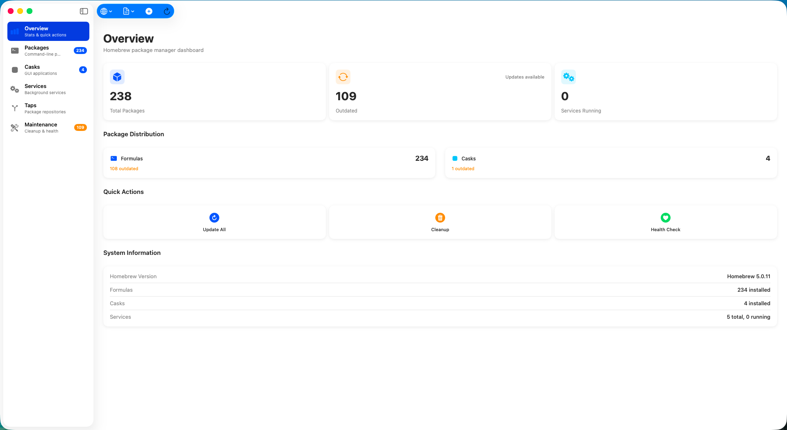
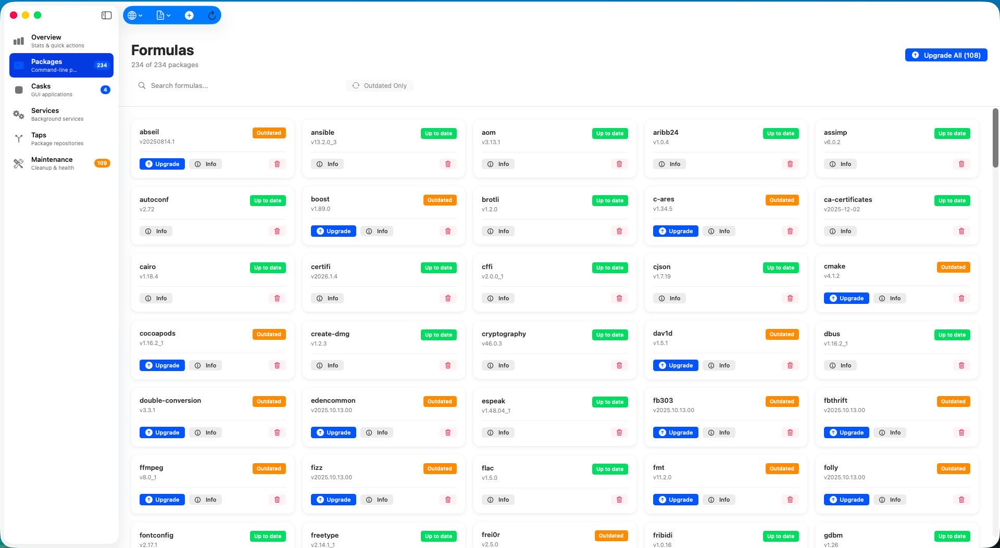
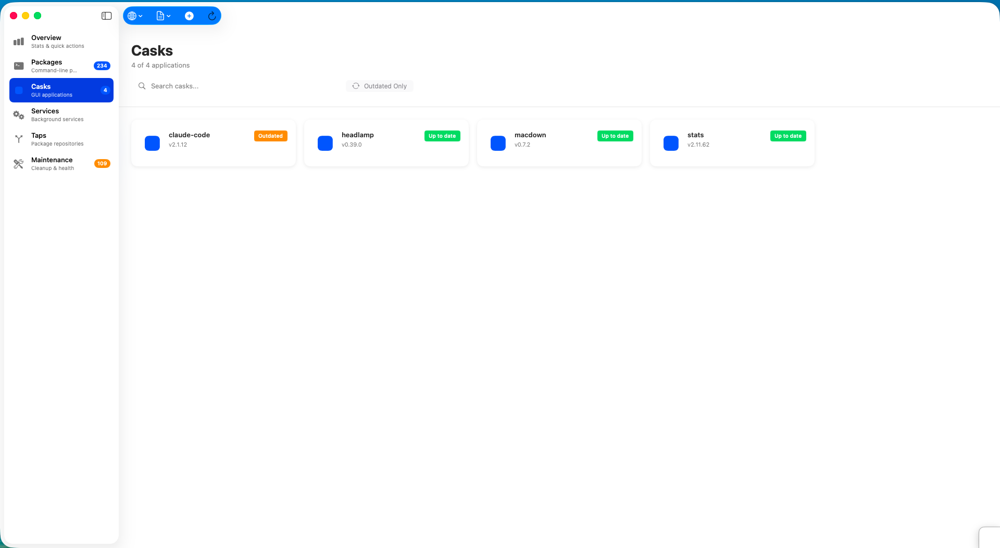
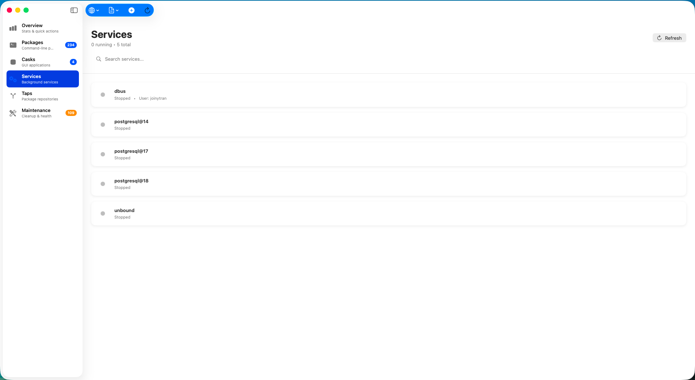
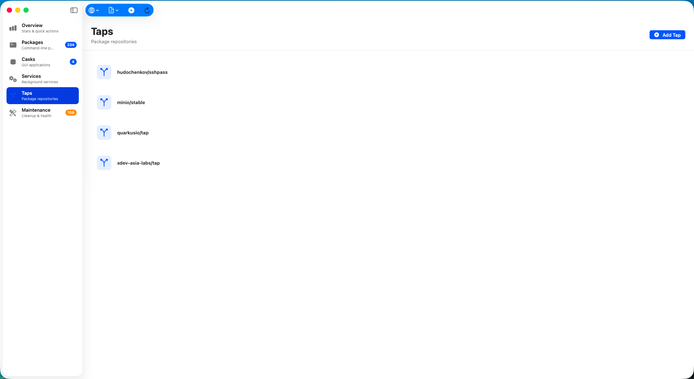
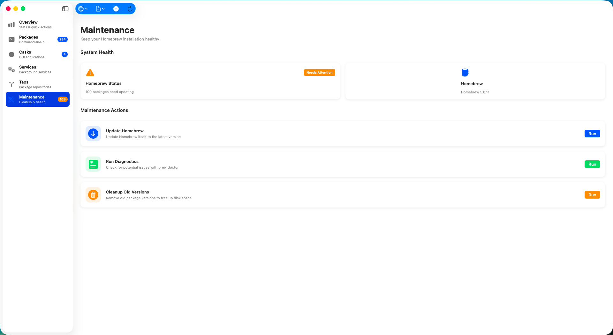

# xBrew

<div align="center">
  
  
  ### Modern Homebrew Package Manager for macOS
  
  Beautiful, fast, and intuitive GUI for managing your Homebrew packages, casks, and taps.
  
  [](https://www.apple.com/macos/)
  [](https://swift.org/)
  [](LICENSE)
</div>

---

## ✨ Features

### 📦 Package Management
- **Install, Uninstall, Upgrade** packages and casks with terminal output
- **Search** across all available Homebrew formulae
- **View Details** including dependencies, homepage, and descriptions
- Track **outdated packages** and update with one click

### 🎯 Tap Management
- **Browse** all installed taps
- **Add/Remove** third-party repositories
- View package counts per tap

### 🛠 Maintenance Tools
- **Update Homebrew** to latest version
- **Cleanup** old package versions to save disk space
- **Health Check** with `brew doctor`
- Real-time terminal output for all operations

### 🌍 Multilingual
- **Vietnamese** (Tiếng Việt)
- **English**
- Easy language switching

### 💾 Brewfile Support
- **Export** current packages to Brewfile
- **Import** packages from Brewfile
- **iCloud Sync** (optional)

### 🎨 Modern Design
- Native macOS design following Ventura/Sonoma guidelines
- Dark mode support
- Smooth animations and transitions
- Intuitive navigation

---

## 📸 Screenshots

### Dashboard


*Quick stats and maintenance actions at a glance*

### Package Management


*Browse, search, and manage your installed packages*

### Tap Management


*Manage third-party Homebrew repositories*

### Maintenance Tools


*Update, cleanup, and health check your Homebrew installation*

### Terminal Output


*Real-time terminal logs for all operations*

### Multilingual Support


*Vietnamese and English language support*

---

## 🚀 Getting Started

### Requirements
- macOS 13.0 (Ventura) or later
- Homebrew installed (or use built-in installer)
- Xcode 15.0+ (for building from source)

### Installation

####  Build from Source
```bash
# Clone the repository
git clone https://github.com/xdev-asia-labs/xBrew.git
cd xBrew

# Generate Xcode project
xcodegen generate

# Open in Xcode
open xBrew.xcodeproj

# Build and run (⌘R)
```

---

## 🏗️ Architecture

xBrew follows a clean, modular architecture:

```
xBrew/
├── Services/
│   ├── AppConfig.swift              # Centralized configuration
│   ├── HomebrewModels.swift         # Data models
│   ├── HomebrewManager.swift        # Core manager
│   ├── HomebrewManager+Commands.swift   # Command execution
│   ├── HomebrewManager+Packages.swift   # Package operations
│   ├── HomebrewManager+Taps.swift       # Tap management
│   ├── BrewfileManager.swift        # Brewfile support
│   └── LocalizationManager.swift    # i18n
├── Views/
│   ├── DashboardView.swift          # Main dashboard
│   ├── ModernPackagesView.swift     # Package list
│   ├── ModernCasksView.swift        # Cask list
│   ├── ModernTapsView.swift         # Tap management
│   └── Components/                  # Reusable UI components
└── Resources/
    ├── Localizations/               # Language files
    └── xBrew.entitlements          # Sandbox permissions
```

### Key Design Decisions
- **Modular services**: Separated into focused extensions (~50-120 lines each)
- **Centralized config**: All settings in `AppConfig.swift`
- **Targeted refresh**: Only refresh what changed (performance)
- **SwiftUI + Combine**: Modern reactive UI
- **Documented models**: Self-explanatory code with examples

---

## 🔧 Configuration

All settings are centralized in `AppConfig.swift`:

```swift
// Homebrew paths (auto-detected)
static let brewPaths = [
    "/opt/homebrew/bin/brew",  // Apple Silicon
    "/usr/local/bin/brew"       // Intel
]

// Timeouts
static let commandTimeout: TimeInterval = 300  // 5 minutes
static let cacheTimeout: TimeInterval = 300    // 5 minutes

// Performance
static let maxConcurrentOperations: Int = 4

// iCloud
static let iCloudContainerID = "iCloud.asia.xdev.xBrew"
```

---

## 🤝 Contributing

Contributions are welcome! Please feel free to submit a Pull Request.

1. Fork the project
2. Create your feature branch (`git checkout -b feature/AmazingFeature`)
3. Commit your changes (`git commit -m 'Add some AmazingFeature'`)
4. Push to the branch (`git push origin feature/AmazingFeature`)
5. Open a Pull Request

---

## 📝 License

This project is licensed under the MIT License - see the [LICENSE](LICENSE) file for details.

---

## 🙏 Acknowledgments

- [Homebrew](https://brew.sh/) - The Missing Package Manager for macOS
- Apple's SwiftUI framework
- All contributors and users

---

<div align="center">
  Made with ❤️ by xDev Asia Labs
  
  [Report Bug](https://github.com/your-username/xBrew/issues) · [Request Feature](https://github.com/your-username/xBrew/issues)
</div>
